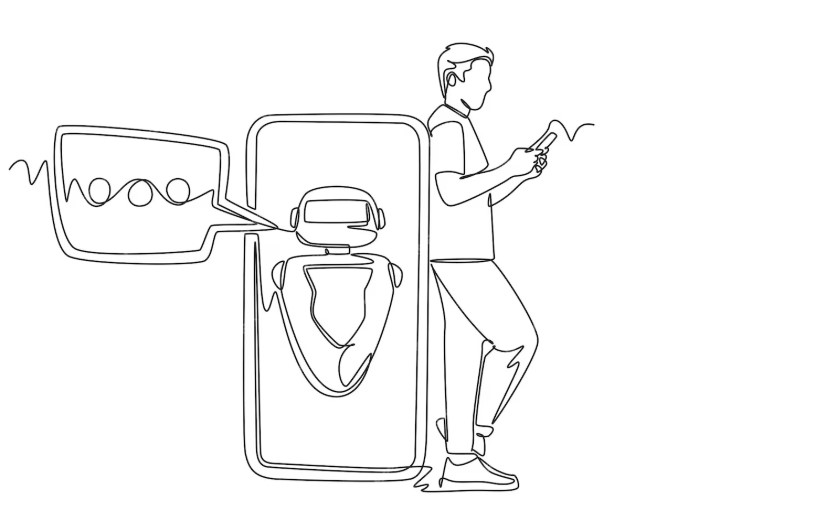
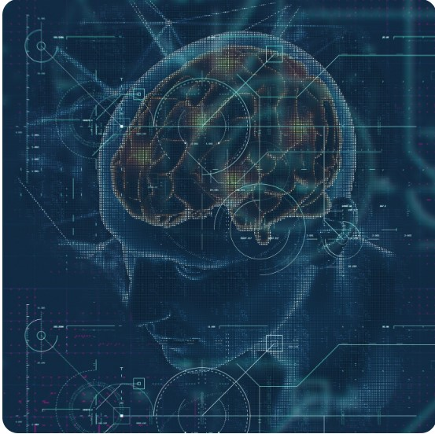

# 🏥 AI Healthcare Bot System

An intelligent chatbot-based healthcare system built with **Python**, **Django**, and **Machine Learning**. It offers health-related assistance, predicts diseases using CNN, and helps locate nearby medical facilities using Google Maps integration.

## 🚀 Features
- 🤖 Chatbot for user health queries
- 🧠 Disease prediction using CNN
- 📍 Hospital/Pharmacy locator using Google Places API
- 🔐 Secure login/register system (Django auth)
- 🗂️ Admin Panel & User Dashboard

## 📸 Screenshots

Here are the main pages of the AI Healthcare Bot System:

### 🧠 Chatbot Page


### 🧠 Chatbot Small (Alternate)


### 🔍 Prediction Page


### 🏥 Hospital/Pharmacy Locator


### 🔐 Login/Register Background


### 🎨 Backup Background


### 🌐 Main Background


## 💻 Technologies Used
- Python, Django
- HTML, CSS, JavaScript
- MySQL
- Google Places API
- Convolutional Neural Networks (CNN)

## 📦 Installation
```bash
git clone https://github.com/himanshumatu2/-Ai-healthcare-bot.git
cd ai_healthcare_bot
pip install -r requirements.txt
python manage.py migrate
python manage.py runserver
